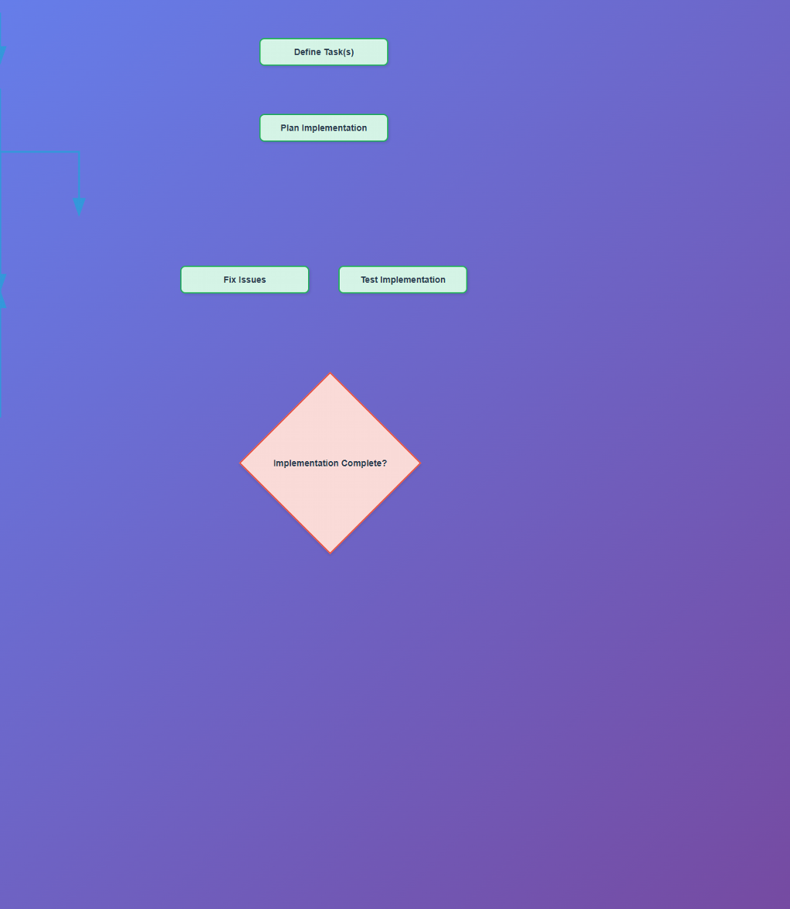

# JSGUI3 Isomorphic Agentic Flowchart Canvas

A professional, high-performance, isomorphic flowchart designer and layout engine built on **jsgui3**. This project demonstrates advanced isomorphic control composition, dynamic client-side activation, and automatic Sugiyama layered graph drawing.



---

## 🌟 Features

* **Isomorphic Composition**: Flowchart components render fully server-side (SSR) into semantic HTML/SVG markup and activate seamlessly in the browser.
* **Automatic Layout Engine**: Implements the **Sugiyama Algorithm** (Layered Graph Drawing) to automatically position tasks and decisions, minimizing edge crossings.
* **Interactive Drag-and-Drop**: Smooth, real-time node dragging in the browser with dynamic, zero-lag recalculation of connecting SVG paths.
* **Orthogonal Routing**: Intelligently routes connection arrows into L-shaped and vertical/horizontal segments for a clean, Visio-like look.
* **Pixel-Perfect Alignment**: Employs mathematically derived vertex offsets to align connection arrows perfectly with rotated decision diamond tips.

---

## 📐 Mathematical Vertex Alignment for Rotated Decisions

Standard UI frameworks struggle with rotated bounding boxes because DOM elements are always rectangular. 

In this application, the **Decision Diamond** is a `200x200px` square rotated by `45 degrees` using CSS `transform: rotate(45deg)` to create a diamond shape:

* **Unrotated half-height**: $100\text{px}$ (where standard HTML bounding box connection points are placed).
* **Rotated vertical diagonal length ($D$)**:
  $$D = 200 \times \sqrt{2} \approx 282.84\text{px}$$
* **Rotated half-diagonal (actual vertical vertex distance from center)**:
  $$D/2 = 141.42\text{px}$$
* **Vertical misalignment (penetration discrepancy)**:
  $$141.42\text{px} - 100\text{px} = 41.42\text{px}$$

Without adjustment, incoming connection arrows penetrate the top point by `41.42px`, and outgoing arrows start `41.42px` inside.

**Our Fix**:
We dynamically detect connections connected to a `type: 'decision'` node and adjust their vertical segment endpoints in both server rendering and client-side real-time dragging:
* **Incoming (to decision)**: Subtract `41.42px` from the target Y coordinate.
* **Outgoing (from decision)**: Add `41.42px` to the source Y coordinate.

This results in a pixel-perfect, tip-to-tip visual connection.

---

## 🛠️ Technical Architecture

### 1. Isomorphic Controls (`flowchart-controls.js`)
Defines the custom isomorphic JSGUI3 elements:
* `Flowchart_Task`: A clean, rounded process step control.
* `Flowchart_Decision`: A rotated diamond decision control with counter-rotated text.
* `Flowchart_Connection`: An SVG-wrapping control that renders custom paths and marker-based arrowheads.

### 2. Layout Pipeline (`flowchart-layout-engine.js`)
Computes coordinates on the server using a 4-phase Sugiyama process:
1. **Graph Construction**: Converts nodes and connections into adjacency maps.
2. **Layer Assignment**: Positions nodes in top-down layers (handling cycles).
3. **Crossing Minimization**: Sorts nodes inside layers using barycentric heuristics.
4. **Orthogonal Routing**: Determines multi-segment horizontal and vertical connection paths.

### 3. Client Activation & Dragging (`client.js`)
Upon loading in the browser, JSGUI3 hydrates the DOM and triggers `activate()`:
1. Restores the control tree and binds event listeners.
2. Attaches mouse listeners to track left-click drag coordinates.
3. Computes dynamic offsets in real-time, executing high-speed SVG path recalculated updates in response to mouse movements.

---

## 🚀 Running the Project

Ensure you are inside the workspace directory (`jsgui3-agents-flowcharts`).

### 1. Start the Server
```bash
node server.js
```
The server will bundle client assets using **ESBuild**, separate CSS/JS, compress the payload using Brotli/Gzip, and start serving on:
`http://localhost:52000`

### 2. Verify and Play
Open the browser, load the page, and try clicking and dragging the task boxes around to see the arrows intelligently route and follow your pointer.

---

## 🧪 Visual QA & Testing

This project includes a comprehensive visual quality assurance system that uses headless Puppeteer to extract DOM geometry, compare it against expected mathematical coordinates, and produce scored reports.

### Quick Commands

```bash
# Full 11-phase QA analysis (with interactive drag test)
node test/visual-qa-analyzer.js

# Save a regression baseline
node test/visual-qa-analyzer.js --save-baseline

# Fast mode (skip drag test)
node test/visual-qa-analyzer.js --skip-drag

# Self-contained CI smoke test (starts/stops server automatically)
node test/smoke-test.js

# Smoke test with custom threshold
node test/smoke-test.js --threshold 90
```

### Analysis Phases

| Phase | What it checks |
|-------|---------------|
| 1. DOM Geometry | Extracts node positions, sizes, and anchor points |
| 2. Connection Alignment | Compares actual SVG path endpoints vs mathematically expected positions |
| 3. Arrowhead Markers | Verifies SVG `<marker>` elements and `marker-end` attributes |
| 4. Viewport Clipping | Detects nodes extending beyond the visible area |
| 5. Node Overlaps | Checks for axis-aligned bounding box collisions |
| 6. Connection Labels | Verifies "Yes"/"No" labels on decision branches |
| 7. Screenshots | Full-page and per-node zoomed captures |
| 7A. Arrowhead Pixels | Samples 20×20px areas along arrow shafts via `elementFromPoint` |
| 7B. Interactive Drag | Simulates node drag, compares screenshots + SVG paths |
| 8. Scoring | Weighted quality score across 7 categories |
| 9A. Regression Check | Compares current score vs saved baseline |
| 9B. Baseline Save | Persists analysis snapshot for future regression detection |

### Scoring Categories

| Category | Weight | What it measures |
|----------|--------|-----------------|
| Connection alignment | 30% | Sub-pixel distance between actual and expected endpoints |
| Arrowhead DOM markers | 10% | SVG marker element presence |
| Arrowhead pixel presence | 10% | Visual confirmation of arrow elements |
| Interactive drag test | 10% | Dynamic arrow recalculation on node drag |
| Viewport clipping | 10% | No nodes cut off by viewport edges |
| Node overlaps | 15% | No visual collisions between nodes |
| Connection labels | 15% | Decision branches have "Yes"/"No" labels |

### Regression Workflow

```bash
# 1. Establish baseline after a good state
node test/visual-qa-analyzer.js --save-baseline

# 2. Make code changes...

# 3. Run analyzer again — it auto-compares against baseline
node test/visual-qa-analyzer.js
# Output includes:
#   ↑ [IMPROVED] Score improved from 90.0% to 100.0%
#   ✗ [REGRESSED] Connection 3→4 start alignment regressed: 0.0px → 5.2px
```

Baselines are saved to `test/baselines/qa-baseline.json`.

### Shared Geometry Library

The core geometry extraction and analysis functions are available as a reusable module:

```javascript
const {
    extract_node_geometry,
    extract_connection_geometry,
    compute_expected_endpoints,
    pixel_distance,
    classify_alignment,
    analyze_flowchart,    // High-level convenience function
} = require('./test/lib/flowchart-geometry');
```

This enables building custom E2E tests that leverage the same mathematical engine.

---

## 📁 Project Structure

```
jsgui3-agents-flowcharts/
├── server.js                        # Entry point — starts jsgui3 server on port 52000
├── client.js                        # Client-side activation + drag handling
├── flowchart-controls.js            # Isomorphic control definitions (Task, Decision, Connection)
├── flowchart-layout-engine.js       # Sugiyama layout + orthogonal edge routing
├── README.md
└── test/
    ├── visual-qa-analyzer.js        # Full 11-phase QA analyzer (~950 lines)
    ├── smoke-test.js                # Self-contained CI smoke test
    ├── lib/
    │   └── flowchart-geometry.js    # Shared geometry extraction + analysis module
    ├── screenshots/                 # Auto-captured during analysis
    ├── reports/                     # Timestamped QA reports (txt + json)
    └── baselines/                   # Regression baselines
```
